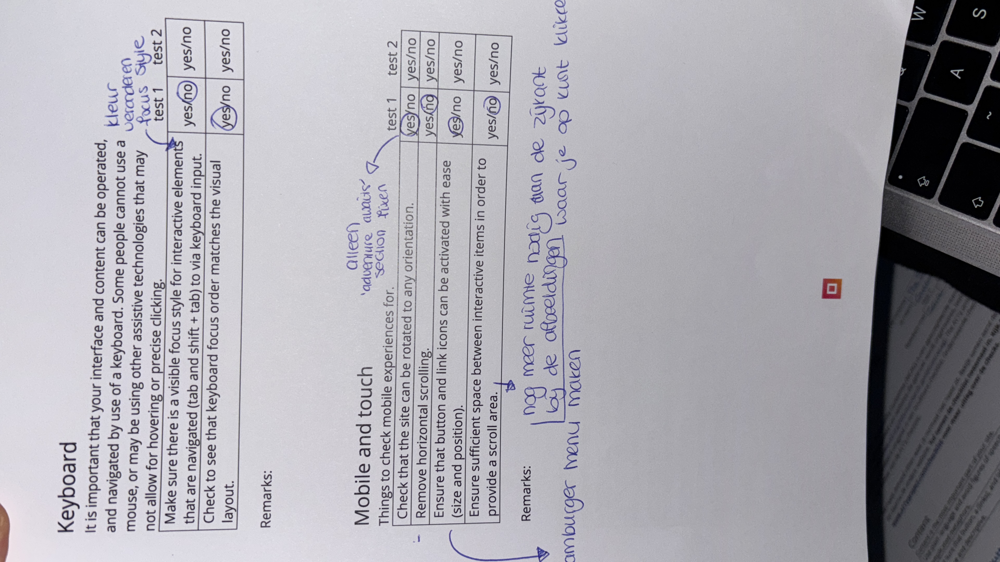

# Procesverslag
Markdown is een simpele manier om HTML te schrijven.  
Markdown cheat cheet: [Hulp bij het schrijven van Markdown](https://github.com/adam-p/markdown-here/wiki/Markdown-Cheatsheet).

Nb. De standaardstructuur en de spartaanse opmaak van de README.md zijn helemaal prima. Het gaat om de inhoud van je procesverslag. Besteedt de tijd voor pracht en praal aan je website.

Nb. Door *open* toe te voegen aan een *details* element kun je deze standaard open zetten. Fijn om dat steeds voor de relevante stuk(ken) te doen.

## Jij

  
uitwerken voor kick-off werkgroep

  ### Auteur:
  Gulav Hururi

  #### Je startniveau:
  Blauw

  #### Je focus:
 Responsive
 

## Je website

  
uitwerken voor kick-off werkgroep

  ### Je opdracht:
  link naar de website die je gaat namaken óf de naam/omschrijving van je eigen ontwerp
  The Sims 4 website 
link: https://www.ea.com/games/the-sims/the-sims-4

  #### Screenshot(s) van de eerste pagina (small screen): 
  Homepage   
  

  #### Screenshot(s) van de tweede pagina (small screen):
  Discover 
  
 

## Toegankelijkheidstest 1/2 (week 1)

  
uitwerken na test in 2e werkgroep

  ### Bevindingen
  Lijst met je bevindingen die in de test naar voren kwamen:

Global code: 
- 160 fouten met w3c validator 

Controls: 
- Focus states zijn er wel maar ze zijn niet heel duidelijk. Buttons worden iets donkerder en om de secitons is een dunne lichtblauwe lijn. 

Images: 
- Veel afbeeldingen bevatten tekst, maar dat staat niet in de alt. 

## Breakdownschets (week 1)

  
uitwerken na afloop 3e werkgroep

  ### de hele pagina: 
  

   

  

  ### dynamisch deel (bijv menu): 
  

## Voortgang 1 (week 2)

  
uitwerken voor 1e voortgang

  ### Stand van zaken
  Voordat ik het vak FED volgde heb ik nog nooit met grids gewerkt. Ik deed eigenlijk alles met een flexbox. Op The Sims 4 website staan verschillende secties met afbeeldingen en tekst waarvoor het wel heel handig is om een grid te gebruiken, zoals de "Spotlight" section in mijn website. Daar staan 3 articles waarvan de eerste de gehele breedte is van de andere 2 naast elkaar. In de les hebben we natuurlijk geleerd hoe dat moest dus wilde ik het graag zelf uitproberen. Ik vond het lastig om onder de knie te krijgen hoe een grid werkt, omdat ik me niet zo goed kon inbeelden welke waardes op welke plek staan. Na even geoefend te hebben met de opdrachten op DLO snapte ik het wat beter en ben ik aan de slag gegaan met grids in de "Spotlight" section van mijn website. 

  

  ### Agenda voor meeting
  samen met je groepje opstellen

  | student 1      | student 2          | student 3    | student 4        |
  | ---            | ---                | ---          | ---              |
  | dit bespreken  | en dit             | en ik dit    | en dan ik dat    |
  | en dat ook nog | dit als er tijd is | nog een punt | dit wil ik zeker |
  | ...            | ...                | ...          | ...              |

Agenda: 
- Werken met de grid functie 
- Welke html structurerende elementen zjin het best om te gebruiken
- Linkjes en buttons 

  ### Verslag van meeting
  hier na afloop snel de uitkomsten van de meeting vastleggen

  Tijdens het eerste voortgangsgesprek heb ik gevraagd of alles ook echt een link moest zijn, aangezien de linkjes op de echte website naar allemaal andere pagina's leiden en je maar 2 pagina's hoeft te maken. Alle linkjes mogen leiden naar de tweede pagina die je maakt. Het werd toen duidelijk dat alle linkjes op de pagina mogen leiden naar de tweede pagina die je maakt. 

  Verder had ik wat vragen over de grid functie, maar toen ik er thuis mee aan de slag ging was het al gelukt. 

## Voortgang 2 (week 3)

  
uitwerken voor 2e voortgang

  ### Stand van zaken
  hier dit ging goed & dit was lastig (neem ook screenshots op van delen van je website en code)

  Ik vond het best lastig om van normale classes te switchen naar psuedo classes, omdat ik ineens moest gaan nadenken over welk element waar staat en welke class ik moet gebruiken om alleen dat element te stylen. 

  Ik kreeg bijvoorbeeld dit stuk van mijn section maar niet goed: 
  

  Alles stond te dicht op elkaar en ik wist ook niet zo goed waardoor het kwam. Uiteindelijk heb ik besloten om de  "See all" button weg te laten, omdat het sowieso niet echt toegevoegde waarde had in mijn versie van de website. 

 Na even geoefend te hebben met de psuedo elementen ging het steeds beter, en kon ik bepaalde elementen stylen zonder dat andere elementen meeveranderden, zoals hier: 

  

## Toegankelijkheidstest 2/2 (week 4)

  
uitwerken na test in 9e werkgroep

  ### Bevindingen
  Lijst met je bevindingen die in de test naar voren kwamen (geef ook aan wat er verbeterd is):

- Keyboard: 
focus style is nu veel duidelijker doordat ik een dikke blauwe border heb gemaakt voor de focusstate 

- Images: 
In de alt van afbeeldingen met tekst staat nu ook de tekst. 

## Voortgang 3 (week 4)

  
uitwerken voor 3e voortgang

  ### Stand van zaken
  hier dit ging goed & dit was lastig (neem ook screenshots op van delen van je website en code)

  Hier ging ik bezig met dingen als een form en hamburgermenu. Het hamburgermenu vond ik wel lastig om te maken. Ik had namelijk een code van YouTube die ik wel begreep, maar tijdens het gesprek kwam ik erachter dat dat niet de juiste maniier was. Ik had de les waarin het hamurgermenu besproken werd ook gemist, maar na het oefenen met opdrachten van DLO, en wat aanpassingen te doen is het me gelukt om een mooi en werkend hamurgermenu te maken. 

  Ook heb ik besloten om de caroussel helemaal weg te laten, en er gewoon een horizontaal scrollbare section van te maken met overflow-x. 
   

  Ook was ik helemaal vergeten om mobile first te beginnen. Alles is wel responsive, maar ik heb dus van een groot naar een klein scherm gewerkt. 

  ### Agenda voor meeting
  samen met je groepje opstellen

  | student 1      | student 2          | student 3    | student 4        |
  | ---            | ---                | ---          | ---              |
  | dit bespreken  | en dit             | en ik dit    | en dan ik dat    |
  | en dat ook nog | dit als er tijd is | nog een punt | dit wil ik zeker |
  | ...            | ...                | ...          | ...              |

Agenda: 
- Hamburgermenu 
- Caroussel 
- Form 

  ### Verslag van meeting
  hier na afloop snel de uitkomsten van de meeting vastleggen

  - Het hamburgermenu moet ik nog aanpassen, omdat ik eigenlijk een soort css code in js heb gezet, terwijl dat niet de bedoeling is. En ik moet erop letten dat de knop om het hamburgermenu te openen en de knop om het menu te sluiten op dezelfde plek staan. 
  - Caroussel of weglaten of ervoor zorgen dat ik het helemaal begrijp. In plaats van een caroussel kan ik de afbeeldingen en tekst ook naast elkaar zetten en met css kunnen laten scrollen. 
  - Form focus state wat duidelijker maken en in de focusstate al feedback geven met :focus valid. 

## Eindgesprek (week 5)

  
uitwerken voor eindgesprek

  ### Je uitkomst - karakteristiek screenshots:
  
  
  
  
  

Toen ik mijn website uploadde op github zag ik dat de website niet goed werkt op Safari. De footer en header zien er bijvoorbeeld zo uit: 
 

Een paar andere sections zien er ook niet uit zoals het hoort, maar als je de website opent op FireFox ziet het er wel goed uit. Ik vind het jammer dat het niet werkt zoals het hoort, maar ik had helaas geen tijd meer om dit op te lossen. Gelukkig werken alle functies gewoon zoals het hoort op FireFox. 
 
Verder pakt de focus state ook niet goed op de image linkjes in mijn footer: 

Ik snap niet zo goed hoe dat komt. Ik heb het proberen op te lossen maar ik kwam er helaas niet uit. 

## Bronnenlijst

  
continu bijhouden terwijl je werkt

  Nb. Wees specifiek ('css-tricks' als bron is bijv. niet specifiek genoeg). 
  Nb. ChatGpT en andere AI horen er ook bij.
  Nb. Vermeld de bronnen ook in je code.

  1. Autumn sale animatie bron: https://www.youtube.com/watch?v=KD1Yo8a_Qis*/
  2. Autumn sale scrollbar weghalen: https://developer.mozilla.org/en-US/docs/Web/CSS/scrollbar-width
  3. Form bron: https://www.youtube.com/watch?feature=shared&v=awNYtIAu6pI*/
  4. https://developer.mozilla.org/en-US/docs/Web/CSS/scrollbar-width

